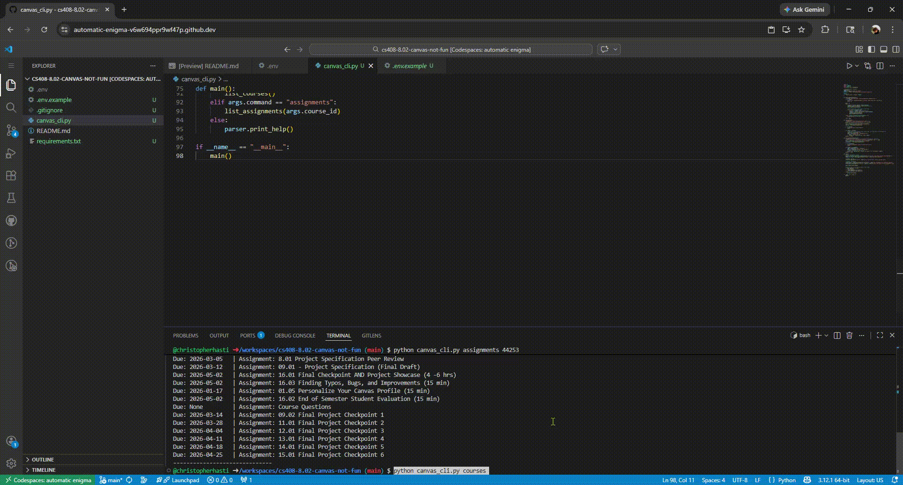

# Canvas CLI Assignment Tracker
A simple command-line interface to quickly check active Canvas courses and upcoming assignments right from the terminal.

## Demo

## Setup Instructions
1. Clone this repository: `git clone <your-repo-url>`
2. Navigate to the directory: `cd <your-repo-name>`
3. Install dependencies: `pip install -r requirements.txt` (Make sure to run `pip freeze > requirements.txt` before pushing!)
4. Copy `.env.example` to `.env` and paste your Canvas API token inside.

## Usage
**List all active courses to get their IDs:**
`python canvas_cli.py courses`

**List your global Canvas TODO items:**
`python canvas_cli.py todos`

**List assignments for a specific course (replace 12345 with your actual course ID):**
`python canvas_cli.py assignments 12345`

**List announcements for a specific course:**
`python canvas_cli.py announcements 12345`

**Submit a URL to an assignment:**
`python canvas_cli.py submit 12345 67890 "https://github.com/your-username/your-repo"`

## API Endpoints Used
| Endpoint | Method | Description |
|---|---|---|
| `/api/v1/courses` | GET | Retrieves a paginated list of active courses the user is enrolled in. |
| `/api/v1/courses/:id/assignments` | GET | Retrieves a paginated list of assignments for a specific course ID. |
| `/api/v1/users/self/todo` | GET | Retrieves a paginated list of the current user's global TODO items. |
| `/api/v1/announcements` | GET | Retrieves a paginated list of announcements for a given course. |
| `/api/v1/courses/:course_id/assignments/:assignment_id/submissions` | POST | Submits a URL (like a GitHub repo) for a specific assignment. |

## Reflection
Writing this project was really fun. I have some minor experience with API calls with personal passion projects but never anything I wasn't worried was going to charge me $300 a call. Everytime I get into the weeds with something like hiding my keys with "env" it terrifies me and usually I just tinkle myself and run off. That being said this lab forced me to trust my ability to push a publilc commit with important things hidden. I had never SERIOUSLY used anything like .gitignore and this is the guy who thought creating a publically acessible IP last assignment was scary. Mentally, telling github to just ignore an academic career ending catastrophe is equivalent to letting your freshman friend belay you on the rock wall 80ft in the air. Jokes aside I have now gained the confidence to re-look over a couple of my wild API ideas and ive had some "fun" with the knowledge ive gained. 

Besides the technicals the code was super easy and AI helped me with the API call functions after reading some basic documentation. I plan to go back and add some more features as once the boiler plate is down calling API's is light work. I did attempt the ARM section but I have a feeling this wont be submitted as ive almost puked myself with the amount of translation layers running so far. You would think a company that has been dedicated to "Windows on ARM" for the last 10 years would give some at least PASSABLE tools to help developers. To be honest there just isnt a ton to talk about with this lab and by the time you've gotten this far the code running in the background to give myself a 100% should have executed... kidding.

**P.S. As requested for those "sweet bonus points": This exact GitHub repository URL was submitted to Canvas straight from the terminal using the `submit` feature built into this very tool!**

3/11/26 7:03 - I HATE ASSEMBLY I HATE ASSEMBLY I HATE ASSEMBLY I HATE ASSEMBLY